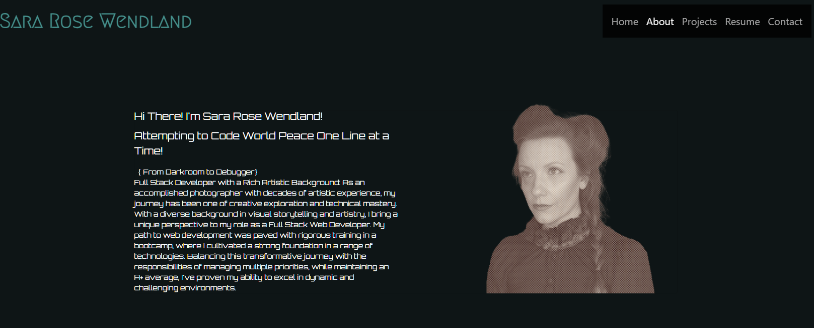
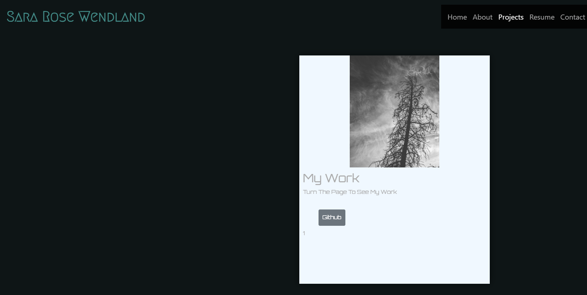

# Sara-Rose-Wendland-Full-Stack-Developer

## Description.

Welcome to my professional [portfolio](https://sara-rose-wendland-portfolio.netlify.app/), the premium destination for showcasing my Full Stack Development projects. As a part of the Developer Community, this application offers users a unique and informative place to view my work. By providing comprehensive user functionalities, including navigation to an about, resume, portfolio, contact, and home page users can effortlessly view work samples, and download a resume. 

## Table of Contents:
- [Overview](#Overview)
- [The Challenge](#The-Challenge)
- [Usage Information](#Usage-Information)
- [Installation Process](#Installation-Process)
- [Built With](#Built-With)
- [What I Learned](#What-I-Learned)
- [Continued Development](#Continued-Development)
- [License](#License)
- [Author](#Author)
- [Acknowledgments](#Acknowledgments)

#### The following screenshot demonstrates the application functionality:

## Usage Instructions:

 1. Navigate to https://sara-rose-wendland-portfolio.netlify.app/
 2. Click on any of the Nav Titles to view the corresponding page (About, Portfolio, Contact, Resume)
 3. Browse pages to view the React Portfolio of work samples, view experience, download full resume, and get to know a little bit about me. 

 
## Deployed Application Link: 
[Sara Rose Wendland - Portfolio](https://sararosebud.github.io/Sara-Rose-Wendland-Full-Stack-Developer/)

## Installation Process:
1. Clone the Repository from GitHub (or) Download Zip Folder from Repository from GitHub.
2. Open the cloned (or downloaded) repository in any source code editor.
3. Open the integrated terminal of the document and complete the respective installation guides provided in "Built With" to ensure the cloned documentation will operate.

## Built With:

- Dynamic JavaScript
- JSON: [JSON](https://www.npmjs.com/package/json)
- Node.js: [16.18.1](https://nodejs.org/en/blog/release/v16.18.1/)
- Nodemon: [2.0.12](https://www.npmjs.com/package/nodemon/v/2.0.12)
- Fontawesome: [6.4.0](https://www.npmjs.com/package/@fortawesome/)
- dotenv: [16.0.3](https://www.npmjs.com/package/dotenv)
- JsonWebToken: [9.0.0](https://www.npmjs.com/package/jsonwebtoken)
- React: [18.2.0](https://www.npmjs.com/package/react)
- React-Dom: [18.2.0](https://www.npmjs.com/package/react-dom)
- JWT: [9.0.0](https://jwt.io)
- Visual Studio Code: [Website](https://code.visualstudio.com/)
- Github Pages
- St PageFlip
- Bootstrap
- CSS
- Framer Motion
- Type Animation
- Text Transition
- Toastify

## Special Thanks:
-[Dipesh Malvia](https://securewebsolutions.teachable.com/p/intro-to-hacking-web-applications)

